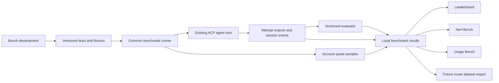

# Distill benchmark workspace implementation plan

Status: B00–B11 software foundation implemented and Windows acceptance passed for the supported profiles. Reviewed and revised on October 1, 2026 (see [Review revision](#review-revision-october-1-2026)). Provider capability and measurement limits are recorded below.

Date: September 30, 2026, America/Los_Angeles.

Implementation inspection: working checkout at `76ca3505`, including current uncommitted account, host and chat changes. File names below are implementation targets, not claims that the new APIs already exist. Recheck these seams before each implementation change.

Navigation: [Product workflow](#user-workflow), [measurement rules](#measurement-contract), [code integration](#architecture-and-integration), [detailed contracts](#detailed-implementation-specification), [work packages](#implementation-sequence-and-acceptance), [validation](#validation-plan).

Goal-alignment review: September 30, 2026. This revision closes gaps in task/decision schemas, role coverage, candidate identity, comparable cohorts, evidence freshness and the future selector handoff. It also aligns B11 with the implementation brief: deliver the automation capability, disabled by default. Native execution isolation and provider telemetry remain implementation gates that require experiments.

## Purpose and decision

Add **Benchmarks** below **Skills** in the main sidebar. It opens a native Distill workspace with four sections: **Leaderboard**, **Bench development**, **Nerf Bench**, and **Usage Bench**. Tests created or imported through Bench development supply every measurement. Runs and their history are shared views within these sections, not a fifth top-level section.

**Collection has one owner:** published benchmark definitions and the common benchmark runner. Leaderboard, Nerf Bench and Usage Bench are analysis/presentation views over the same evidence. The last two sections have no private tests, inference loops or independent collectors. A Run/retest action anywhere opens the same dialog with published definitions selected.

The first release delivers a complete local loop: define a test, compare selected configurations, inspect the evidence, and retain results that can later train a router. Model routing and coordinator training remain subsequent work.

The eventual product goal is **task/context + available candidates + quality/resource constraints -> a supported provider/model/native-effort choice**. This release delivers the evidence and a tested read-only contract needed by that consumer. Four working tabs and a JSONL download alone do not satisfy the foundation's acceptance criteria.

Use BridgeBench for its presentation patterns. Keep Distill's measurement rules explicit and reproducible. Store individual outcomes, not just a leaderboard score.

### Requirements traced to delivery

| User requirement | Required implementation and acceptance |
| --- | --- |
| Create the tests that drive all measurements | Versioned authoring and common runner, B01–B04. All three result views read their evidence; no view owns a private test loop. |
| Compare the available models and effort levels | Account-aware inventory, exact candidate IDs and capability coverage, B00/B03/B05/B11. All discovered choices are visible; missing support or missing measurements have explicit reasons. |
| Rate models for the kinds of work Distill delegates | Existing work-class/role mapping plus coverage fixtures, B01/B05/B08–B10. Planning, research and verification have coverage alongside code/UI. |
| Detect silent quality and allowance changes | Separate fixed baselines, repeated samples and attribution, B06/B07. Mixed account usage never becomes a per-task quota label. |
| Avoid manually rebuilding rankings after model releases | Versioned candidate lifecycle and budgeted calibration/retesting campaigns, B11. New models enter as untested; stale evidence cannot silently count as current. |
| Prepare automatic provider/model/effort selection | Pre-decision records from B01/B04 and the evidence-query/export consumer test in B10. Preserve native effort, context, constraints and resource units. |
| Improve real orchestration later | Frozen step-entry fixtures and bounded workflows in B08/B10; later full-policy evaluation remains explicit follow-up work. A single-task leaderboard is not evidence of optimal multi-agent behavior. |
| Deliver implementation that can be trusted | Package acceptance, isolated UI checks, independent review and task-scoped commits. Software completion and empirical dataset readiness are reported separately. |

## Reference research

### BridgeBench features and their relevance

The public pages and guides were inspected, including the live leaderboard, its model filter, and a design gallery. Authenticated authoring and BridgeBench's backend were not inspected. Its guides explicitly withhold the evaluation methodology; there is no verified public execution protocol to reproduce.

| Observed feature | Decision for Distill |
| --- | --- |
| Leaderboard with category tabs, model selection, chart/table views and model details | Adopt the navigation pattern. Show measured success, coverage, effort, time and uncertainty. The reference's ratings are comparative assessments, not success percentages. [Leaderboard guide](https://www.bridgebench.ai/blog/how-the-leaderboard-works) |
| Design Bench galleries, interactive outputs, comparison, generation time/cost, qualified/disqualified status | Add an artifact gallery to test results, including local side-by-side review. Design Bench is a visual-output benchmark; our requested test editor is additional functionality. [Design guide](https://www.bridgebench.ai/blog/how-ui-bench-works) |
| A matrix of scenes and model results, including unattempted cases | Adopt explicit coverage. A model tested on one easy case cannot receive a comparable suite rank against a model tested on the complete suite. [Design leaderboard](https://www.bridgebench.ai/ui-bench) |
| Nerf Bench compares later measurements with a 100% starting reference; its illustrative power measure combines quality, tokens and cost, and its display uses a fixed 90–110% band | Adopt history and baseline comparison. Use separate quality, speed and resource series, measured uncertainty and a stated practical effect threshold. A price increase must not become evidence of worse answers. The published example is not the proprietary production formula. [Nerf guide](https://www.bridgebench.ai/blog/how-nerf-bench-works) |
| Usage Bench compares subscription allowance with its first measurement, separately for short and weekly windows | Adopt controlled measurements of effective allowance over time, with a separate baseline for each window. Separate this from current remaining usage. Equal percentages do not imply equal absolute capacity between plans. [Usage guide](https://www.bridgebench.ai/blog/how-usage-bench-works) |
| Community prompt search, copying, votes and submission | Support local prompt/fixture import with provenance. Popularity does not validate a test. Imported prompts remain drafts until their expected result or rubric is defined. [Community prompts](https://www.bridgebench.ai/test-prompts) |
| Social sharing, branded video exports, sponsors and account signup | Omit from the initial local measurement workflow. Export raw results and artifacts for inspection instead. [Public site](https://www.bridgebench.ai/) |

Do not import BridgeBench's ratings as local training labels, infer hidden scoring rules, or describe a beautiful preview as a passing functional test. The reference's public Usage Bench initially has only a starting measurement; this does not establish its long-term detection accuracy.

For missing limits, BridgeBench displays `Not reported`; its guide explicitly says this does not mean zero or unlimited. Its inspected board has this state for ChatGPT Pro's 5-hour window. The private methodology does not establish whether it uses tokens per percentage point or tests to exhaustion. Distill's methods below are our proposed implementation. [Usage guide](https://www.bridgebench.ai/blog/how-usage-bench-works), [Usage board](https://www.bridgebench.ai/usage-bench).

### Sakana findings and resulting revisions

Fugu's June report describes repeated evaluation of every worker on verifiable single-step tasks. It retains each worker's mean reward and trains from a soft distribution over workers rather than only the winning label. A subsequent stage uses complete interactive tasks with repository context, tools and execution feedback. Its evaluations include tasks unseen during coordinator training. Some published baseline scores are provider-reported, so the report is not evidence that every headline comparison was rerun under an identical harness. [Fugu technical report, sections 3.1 and 4.1](https://arxiv.org/html/2606.21228).

The September Fugu Max and Ultra v2 release emphasizes different quality/cost objectives; it does not publicly specify all implementation details of those versions. [September release](https://sakana.ai/fugu-max-release/).

Conductor explicitly experiments with changing the available worker subset. Its controlled and unconstrained evaluations use different reasoning budgets; that is not proof of a learned per-step effort selector. [Conductor paper](https://arxiv.org/html/2512.04388).

These findings change the proposed Distill plan as follows. These are our design decisions, not a claim to reproduce Fugu:

1. Keep the full **case × configuration × repetition** outcome matrix, including failures, instead of only category averages or winners.
2. Assign task families to development, training and held-out evaluation splits before collecting results. Keep close variants and repository families together to prevent leakage.
3. Include both short tasks with objective answers and realistic repository workflows. A visual-demo-only collection would train the wrong selector for everyday development.
4. Record what was known before each routing decision, the eligible candidates, the selected configuration and the final task outcome. Do not use an answer's correctness as an input feature that would be unavailable at decision time.
5. Evaluate future routing against a strong fixed configuration and the current policy with an explicit total budget. Also test unavailable-model scenarios and changed worker pools.
6. Add native effort and fast-mode comparisons ourselves. Fugu's published worker-ranking recipe does not supply these measurements for our providers.

No Fugu service subscription or local coordinator model is required to build this measurement foundation.

## User workflow

```text
Home
Agents
Skills
Benchmarks
  Leaderboard | Bench development | Nerf Bench | Usage Bench
```

### Leaderboard

- Filter by task category, suite version, provider, model, native effort, fast mode and execution track.
- Start with a readable table: configuration, successful tasks, tested/required cases, median time, resource usage, last tested date and evidence status.
- Offer a chart view and configuration details with per-case results, errors, session links and artifacts.
- Start artifact comparison with captured images and text. Enable interactive generated previews only after the isolated preview runner in stage 6 passes its access checks.
- Keep functional correctness, human visual review and any judge-model score in separate columns.
- Show `Untested`, `Preliminary`, `Comparable` or `Stale` with a reason. A new model appears untested until measurements exist.
- A default quality rank uses the same complete case set and fixed aggregation rules. Incomplete rows remain visible without a comparable overall rank. Pairwise common-case comparisons name their reduced coverage.
- Offer quality/time/cost comparisons; any combined preference score exposes its weights and version. Missing cost is never treated as zero.

### Bench development

Provide a library, a guided editor and a per-test Results tab. The minimal editor includes:

- Name, task category, task family, description and source/license.
- Prompt, attachments, fixture files or a reproducible repository snapshot.
- Expected output, protected checks, or an explicit review rubric.
- Tool/network permissions, environment prerequisites and execution track.
- Time/turn limits, supported resource caps, repetitions and split assignment.
- Measurement profile: ordinary task metrics, controlled quota consumption, or a bounded capacity experiment. Quota profiles specify the workload and sampling/idle-account conditions as part of the published version.
- Draft validation, one-case preview, publish version, duplicate and archive.

Publishing freezes a version and hashes its prompt, fixtures, evaluator and environment manifest. Editing creates a new draft; old results retain their original version. Imported definitions are validated, and importing never executes setup commands.

The Run dialog selects published tests, accounts, models, supported efforts and repetition count. It shows the number of executions and an estimate or `Unknown` for expected spend. One click starts the explicitly configured batch. A shared run drawer shows progress, pause, cancel, retained outcomes and session links. Pause finishes active attempts and stops new dispatch; cancel requests cancellation of active attempts as well.

Suggested initial test templates: exact/structured answer, a small code repair with hidden regression checks, frontend implementation with interaction checks and a review rubric, and a bounded repository task. Provide small generic fixtures that can be added to the library; include no private project data by default.

### Nerf Bench

Show changes relative to a selected, repeated baseline for the same configuration and frozen suite. Call it the first Distill baseline, not the model's launch performance unless that is actually known.

Display quality, duration and resource use separately. Distinguish a measured regression, insufficient evidence and changed test conditions. Use paired task comparisons with uncertainty intervals and a predeclared meaningful difference; correct for multiple comparisons when publishing many alerts. A constant ±10% band is not a statistical test.

Pin or record the model revision, agent executable, tools, evaluator, fixtures and environment. When these change, show the boundary and create a new comparable series. A provider alias may change behind the same ID; retain its observed identity and measurement date without inventing an underlying version. A drop records an observation, not the provider's intent.

Retesting is manual initially. A later opt-in schedule can use a stable subset and a fixed budget. Detection never silently rewrites the production model ranking.

### Usage Bench

The primary purpose is to display evidence of unannounced changes in **how much comparable work a subscription allowance buys**. Provider announcements or published absolute token caps are not prerequisites. Keep the current remaining-allowance monitor as supporting context. Every measurement below is a profile of an authored benchmark run; this view reads the resulting records and calculates comparisons.

#### Controlled measurements with a usage meter

1. Select a frozen test batch from Bench development and pin its account, plan, model, effort, harness, context and cache policy. Capture each relevant quota window before execution and after reported usage settles.
2. Record the increase in used **percentage points** for the whole batch, including failed attempts. Retain completed and successful task counts, duration and the reported token breakdown: input, output, cache and reasoning where available. Token fields may overlap; respect each adapter's schema instead of adding everything together.
3. Compare quota spent on the same batch and useful tasks completed per percentage point. Also compare tokens per percentage point where the token composition is sufficiently matched. Missing tokens still permit task-based measurements. A fixed prompt alone does not guarantee a fixed output length or reasoning load.
4. Repeat bounded batches across independent measurement periods. Show uncertainty and a predeclared meaningful-change threshold before issuing a confirmed regression alert. A single sample remains preliminary.

Quota is attributed to the controlled **batch**, not automatically to each task within it. If several tasks share a batch, their quota fields link to the batch observation rather than each claiming its full delta. A task-specific quota measurement requires either a reliable provider-reported per-request charge or a single-task controlled batch with sufficient meter resolution. Token counts alone do not reveal each task's share of a mixed account meter.

For matched work, define `efficiency = work / used_percentage_points` and `retained_effective_allowance = 100 * current_efficiency / baseline_efficiency`. For example, comparable 100,000-token batches using 5 points initially and 10 points later imply half the measured token efficiency. Show `50% of baseline` only with adequate evidence and comparable conditions. This is a workload-specific effective-allowance estimate; extrapolating it to a full window requires checking that consumption is approximately linear over the sampled range.

Maintain separate short-window, weekly and model-specific series according to the provider's actual quota scopes. Keep raw consumption, token-normalized efficiency and successful-work efficiency visible: more verbose answers and heavier quota charging can have different causes. A reproducible decline establishes less work per allowance under the tested conditions. These observations alone may not distinguish a smaller nominal quota from increased per-token/model charging or hidden computation.

Collect source timestamps, meter resolution and delayed updates. Do not dispatch during known competing account activity; pause new samples if that changes. Activity outside Distill can remain unobservable, so record the isolation evidence. Exclude contaminated samples, reset/refill crossings and unresolved telemetry changes from confirmed alerts. Zero movement in a rounded meter means insufficient resolution, not free or unlimited usage; aggregate within the chosen budget or report insufficient evidence. Local configuration or plan changes start a new series. An unannounced provider change behind the same model ID is a target of detection, not a reason to discard a regression automatically.

#### When the meter or limit is missing

| Available evidence | Measurement and result |
| --- | --- |
| Percentage meter but no published absolute cap | Use the controlled efficiency comparison above; an absolute token cap is unnecessary. |
| No meter, but an identifiable allowance-exhaustion signal | Offer a separately selected, budgeted capacity experiment: repeat a fixed workload from a verified full allowance until exhaustion or the run budget. Count completed tasks and reported tokens. An unknown starting balance permits only a remaining-capacity measurement. |
| No exhaustion before the run budget ends | Report `At least N tasks / reported tokens; limit not reached`. Retain the lower bound, not an invented finite capacity or infinity. Two lower bounds alone do not establish unchanged capacity. |
| Missing meter and no capacity experiment | Show `Not measured` or `Unsupported`, with the reason. Retain ordinary performance and consumption observations. |

Exhaustion experiments distinguish subscription depletion from request-rate throttling, service errors and local cancellation. Record which quota window actually blocked work and its recovery signal. Another shared window blocking first leaves the target window's result incomplete. Rolling replenishment that cannot be accounted for prevents a full-capacity estimate. Measure throttling and throughput separately, including for plans described as unlimited.

#### UI and budget

The main view shows effective allowance relative to a selected repeated baseline, normally 100%, with date, window, workload and confidence. A details view exposes before/after readings, attempts, token composition, exclusions and the calculation. Supporting cards show remaining allowance and benchmark consumption. Use `Preliminary`, `Confirmed change`, `Cannot attribute`, `Limit not reached` and `Not measured` where appropriate.

Normal monitoring uses small bounded batches. Testing to exhaustion is an explicit run mode with a visible time/work/quota budget; the runner must identify any normal reserve policy this mode would override. These experiments are planned functionality, not authorization to consume accounts during this research task.

Keep subscription quota units separate from API dollars. API list-price estimates are not actual subscription charges. Do not automatically buy API credits, redeem quota resets or switch a subscription run into paid API usage.

## Measurement contract

### What a row represents

The initial execution track measures **a model running through a particular Distill agent harness**. It is useful for choosing what actually works inside Distill. It is not a pure model intelligence ranking.

A configuration records provider, account/billing context, exact requested model ID, observed model identity/revision when available, native effort, fast mode, agent/bridge version and context/tool policy. Group equivalent accounts for quality only when their effective conditions match; retain account-specific quota and latency measurements.

Do not equate `high` across providers. Compare the actual combinations they advertise. Reuse existing model discovery, but confirm selection after opening the session. Any model/effort/fast substitution invalidates the requested comparison cell; retain the evidence without crediting the requested configuration.

Reserve separate tracks for a future common API harness and for a complete routing policy. Never pool these with native-agent results. This keeps changes in tools or orchestration from being mistaken for changes in model quality.

### Fair execution and scoring

- Every attempt starts from a clean fixture and fresh session with the declared context. Freeze dependency versions, tool permissions and budgets; control warm/cold cache conditions as far as the provider allows and record the rest.
- Disable undeclared memory, skills, hooks and retrieval. Cross-attempt learning is a separate experiment, not part of the default comparison.
- Keep evaluator answers and hidden tests outside the agent's permitted view. A separate working directory alone is not an enforced boundary. If a harness cannot enforce required access/tool restrictions, that test is unsupported on that harness rather than trusted by assumption.
- Prefer deterministic checks. UI tests also exercise required interactions; screenshots and blinded human comparison cover visual quality. LLM judging is optional, versioned, calibrated against reviewed examples and reported separately.
- Validate evaluators with known passing and failing outputs before publishing. A broken evaluator cannot issue model scores. Rescoring creates a new evaluation revision without overwriting the original verdict.
- Separate valid model failure, timeout under the task budget, infrastructure failure, quota block, unsupported configuration, cancellation and unattempted cells. Report reliability alongside quality; exclusions remain visible.
- Predetermine repetitions and ordering, randomize/interleave configurations where practical, and retain every attempt. Never select only the best response. A one-run preview and a small repeated pilot are preliminary evidence.
- Report task-level coverage and uncertainty. Repeats of one task are not additional independent task families. Statistical calculations must respect that grouping.
- Capture full task cost, including evaluation and any configured additional attempts. Record absent token/cost fields as unknown. ACP cancellation and sampled usage cannot promise an exact token or dollar ceiling when the provider exposes no enforceable cap.

### Cost control and recovery

Use one active benchmark attempt per account initially, with an explicit small global concurrency limit. Before dispatch, check fresh eligibility and the reserved allowance. Existing interactive work takes priority. If quota telemetry is unknown, require a bounded run policy rather than assuming unlimited capacity.

Persist the planned batch before dispatch and assign unique attempt IDs. Record acknowledged sessions and turn IDs. On restart, reconcile existing attempts with the host; do not blindly send the prompt again. Ambiguous in-flight attempts require inspection. Already accepted work must not be replayed automatically.

No fallback to a different model or account inside a scored attempt. Add an explicit benchmark execution policy to prevent the normal chat account-switching path from changing its target; record quota blocking instead. A requested rerun is a new linked attempt. Planned repetitions are independent cells established before the batch, not concealed retries after failure. Task budgets define whether internal tool iterations are permitted.

## Architecture and integration

Use one benchmark service inside the existing Rust application process and one React feature. A database and event stream belong to that service. Reuse the ACP host, provider/account inventory and telemetry adapters; do not create another provider login or agent execution stack.



### Existing integration points verified

| Area | Existing location and planned change |
| --- | --- |
| Main sidebar | `src/features/navigation/ui/PrimaryNavigationSurface.tsx` and `sidebarNavIcons.tsx`: add Benchmarks after Skills using existing UI tokens. |
| Navigation history and breadcrumbs | `src/app/types/appNavigation.ts`, `src/app/lib/appNavigationLocation.ts`, `src/app/AppShell.tsx`, `src/app/views/NavigationPanesView.tsx`: add the route with section/test/run selection and preserve Back/Forward. |
| Model discovery | `src/features/providers/hooks/useAccountModels.ts`, `stores/providerModelCacheStore.ts`, and host `providers/supported_models/list`: reuse account-scoped inventories and capability provenance. Extract a shared data function where a React hook is currently the only consumer interface. |
| Actual selection | `docs/model-effort-fast-selection.md`, `src/shared/api/acpSessionRegistry.ts`, host `router.rs`: reuse acknowledgement and substitution semantics; benchmark cells require an exact match. |
| Accounts and quota | `docs/provider-accounts.md`, `src/features/providers/stores/providerAccountsStore.ts`, `src/features/status/lib/rateLimitTypes.ts`, backend account-status services: use current account-aware monitoring and freshness. |
| Session execution and history | `src-tauri/src/services/agent_host/{router,store,harness_env}.rs`: add a narrow internal execution interface for benchmark-owned sessions, using the same session lifecycle. The current host is not assumed to expose a ready-made headless benchmark API. |
| Storage | `src-tauri/src/services/distill_root.rs` and `docs/distill-root-layout.md`: resolve benchmark data under the configured root. |
| Future routing compatibility | `src/features/agents/lib/{modelRanking,agentModelRanking,rankedPersonaTarget,routingPolicy}.ts` and `src/features/conductor/roleCatalog.ts`: reuse work-class/role identities; provide evidence through a read-only interface without changing current dispatch policy. |
| Existing Wave telemetry | `src/features/conductor/waveTelemetryStore.ts`: retain its existing purpose. Its selected-outcome records and bounded history are not a complete benchmark reward matrix or an authoritative source of per-task quota. |

Proposed new modules: `src/features/benchmarks/` for UI, types and its service client; `src-tauri/src/services/benchmarks/` for catalog, runner, evaluation, queries and export; `src-tauri/src/commands/benchmarks.rs` for the Tauri boundary. Add a benchmark translation namespace following existing locale conventions. Keep scheduling and persistence independent of whether the tab is mounted. Preserve the existing close guard: active attempts must finish or be cancelled before normal application exit. Queued work is parked durably and requires resume after restart; no separate background daemon is proposed.

One typed service API owns definition creation/versioning, plan validation, run start/pause/resume/cancel, result queries, baseline selection and export. Events carry run/attempt IDs and a durable sequence number so a reopened view can catch up. Existing chat history remains authoritative for session transcripts; benchmark storage links to it and retains evaluation evidence.

Store editable definitions, frozen versions, fixtures, run manifests and artifacts under `<DISTILL_ROOT>/benchmarks/`. A dedicated `benchmarks.db` stores execution state and queryable results, keeping benchmark growth out of the conversation database. Session links refer to existing host IDs. Document backup, retention and deletion semantics; removing a draft must not erase evidence referenced by an old run.

### Minimum data records

| Record | Required information |
| --- | --- |
| Benchmark version | IDs/hashes, task family/category, split, prompt/attachments, fixture and environment manifests, evaluator/rubric version, permissions, limits and source/license. |
| Configuration snapshot | Provider/account, billing mode, requested and observed model/effort/fast, inventory revision/provenance, agent version, context policy and tool set. |
| Run plan | Frozen case/configuration matrix, repetitions, order, budget, concurrency, timestamps and user-selected options. |
| Attempt | Run/case/configuration/repetition, lifecycle and failure class, session/turn IDs, start/end times, output/artifact references and observed selection. |
| Evaluation | Attempt, evaluator revision, component results, aggregate outcome, review provenance and uncertainty inputs. |
| Usage observation | Scope, account/plan/window, source timestamps/reset boundary, meter precision and settling state, token breakdown schema, raw source provenance, concurrent-activity evidence and attribution quality. |
| Allowance experiment | Frozen workload/configuration, measurement mode, starting-balance evidence, sample groups, work/token totals, quota deltas, budget/stop reason, observed blocking scope and measured/estimated/lower-bound/unknown result. |
| Decision snapshot | Pre-decision task/entry-state references, work class/role, candidate set, constraints, live availability freshness, feature-schema version and selected candidate ID. |
| Baseline and comparison | Frozen cohorts, comparison policy, conditions hash, time range, practical threshold, uncertainty, efficiency/calculation version and supporting attempt IDs. |
| Dataset export | Schema and split manifest, source versions, eligibility rules, per-case reward vectors, observed/missing masks and export hash. |

For later routing, retain pre-decision task/context features and the eligible candidate set. Full-matrix measurements can provide labels for alternatives; ordinary production logs cannot establish what an unselected model would have achieved. Do not convert missing outcomes into zero rewards. Never include credentials or hidden evaluation answers in router input features.

### Relevant laws and existing work

Follow `LAWS/AGENTS.md`, `CHAT.md`, `MEMORY.md` and `WAVES.md`. Benchmark sessions have a concrete provider/model before invocation. Any reused chat queue preserves its acceptance and dispatch guarantees. Benchmark results do not enter personal memory or project knowledge automatically.

Do not route a large benchmark matrix through a Wave merely to reuse its runner: Waves currently allow one to five steps and one live wave per conductor. Keep benchmark batches separate, with direct links to their sessions. A future Wave benchmark remains subject to the existing access, verification and retry rules. The model/effort proposal in `LAWS/PROPOSAL-2026-09-model-effort.md` is explicitly not an adopted law.

The inspected checkout already contains active account, quota, chat and host edits. Implementation must recheck that work and integrate with its latest contracts instead of reverting or duplicating it.

## Detailed implementation specification

### 1. Code findings that change the implementation order

| Verified seam | Consequence |
| --- | --- |
| `agent_host/router.rs`: `Inner.frontend` stores one renderer connection; replacing it drains pending client requests. | Do not connect the benchmark runner as another ACP WebSocket client. Add a typed in-process host interface. |
| `new_session`, `prompt`, selection application and bridge routing are private host methods. | Reuse their internals through the new interface; do not reproduce the agent lifecycle in benchmark code. |
| `mcp_servers()` appends enabled global servers even when the caller passes `[]`; `apply_mode()` reads global settings. | A benchmark needs an explicit execution policy with a frozen MCP list and mode. An empty list must actually mean none for that policy. |
| `route_account_for_dispatch()` can choose another account according to the provider setting. | Pinned benchmark sessions must bypass account substitution at every dispatch and reopen, independently of the ordinary-chat setting. |
| `name_untitled_session()` can make a separate model call; hidden or already named sessions skip it. | Set a deterministic title and explicit no-title-generation policy before the first prompt. Count any other auxiliary inference separately. |
| `on_bridge_request()` forwards permission requests to the renderer; `acpConnection.ts` normally chooses `allow_once` when offered. | Benchmark permissions must be answered by the benchmark host policy before renderer forwarding. The ordinary chat permission callback is not a benchmark sandbox. |
| `flush_pending_events()` persists event batches before forwarding them, with event IDs. `history_page()` reads complete turns backwards. | Add a forward cursor reader for bounded benchmark evidence ingestion and a committed-event notification. Reuse the durable transcript. |
| `TurnIds::for_prompt()` accepts a message ID but creates a new run ID. | A repeated message ID does not provide dispatch idempotency. Add a durable benchmark dispatch record at the host boundary. |
| Failure notices and some usage notices are deliberately live-only; Grok usage normalization supplies zeros for missing fields. | Capture relevant outcome and usage evidence before loss of field-presence information. Do not infer unknown fields from normalized zeros. |
| `provider_account_status` exposes account-scoped windows, separate freshness timestamps and single-flight refreshes. Only Claude and Codex currently have managed accounts. | Extend this service with targeted samples and provenance. Other providers remain discoverable, but unsupported account or quota capabilities are visible per configuration. |
| `usage_update.used/size` are used by the chat as context occupancy; `usageRecorder.ts` projects live usage into the Stats ledger. | Neither the context meter nor the Stats ledger is the source of subscription consumption. Benchmarks need their own durable accounting derived from host evidence. |
| `memoryWriteAccess.ts` permits ordinary sessions with no graph node. | Persist benchmark ownership and deny memory/recall processing explicitly, including after reopening a transcript. Omitting a conductor node is insufficient. |
| `closeGuard.ts` calls `prepare_agent_host_shutdown`; the host refuses shutdown while a turn is active. | Add benchmark queue parking to this handshake and preserve the existing active-turn protection. |
| `ProjectArtifactPreview.tsx` draws a project glyph; E2E mode redirects the app profile. | Neither is an evaluator or a security boundary for executing generated code. Build and verify those capabilities explicitly. |

### 2. Module ownership and dependency direction

Keep the feature in the existing Tauri process. SQLx, SQLite, Tokio, serde, SHA-256, React Query, Zod, existing UI primitives and the current test tools are already dependencies. No new service, account store, message broker or training runtime is needed for the core feature.

```text
src/features/benchmarks/
  types.ts                     Wire DTOs and discriminated states
  api/benchmarks.ts             The only frontend IPC client
  hooks/useBenchmarks.ts        Queries, mutations and event invalidation
  stores/benchmarkViewStore.ts  Disposable filters, selections and drawer state
  lib/benchmarkNavigation.ts   Four sections and detail locations
  ui/BenchmarksView.tsx         Feature shell
  ui/LeaderboardView.tsx
  ui/BenchDevelopmentView.tsx
  ui/BenchmarkEditor.tsx
  ui/NerfBenchView.tsx
  ui/UsageBenchView.tsx
  ui/BenchmarkRunDialog.tsx
  ui/BenchmarkRunDrawer.tsx
  ui/BenchmarkEvidenceView.tsx

src-tauri/src/services/benchmarks/
  mod.rs            BenchmarkService and public domain operations
  types.rs          Validated DTOs, states and units
  store.rs          SQLx transactions, queries, migrations and event cursor
  catalog.rs        Drafts, immutable versions, suites and import/export
  runner.rs         Admission, queue, attempts, cancellation and recovery
  evaluation.rs     Objective checks, rubrics and evaluation revisions
  usage.rs          Runner-owned usage sampling and batch attribution
  analysis.rs       Cohorts, aggregation, baselines and regression calculations
  export.rs         Versioned result and future-router datasets
  fixtures.rs      Staging, manifests, hashes and artifact collection

src-tauri/src/services/agent_host/execution.rs   New typed internal execution seam
src-tauri/src/commands/benchmarks.rs            Thin Tauri commands
src-tauri/migrations_benchmarks/               New benchmark database migrations
```

These are ownership boundaries; do not create empty modules ahead of the stage that uses them. Add `usage.rs` under `agent_host/` only when extracting the existing usage normalization and raw-evidence adapter from `router.rs`. Provider authentication remains in `provider_accounts`; quota fetching remains in `provider_account_status`; provider process spawning remains in `agent_host`.

Register a lazy `BenchmarkService` in `src-tauri/src/lib.rs`, after the root state is available. Add module/command registrations in the existing `mod.rs` files and `generate_handler!`. Migrations and recovery finish before commands permit dispatch. Registering the feature must not launch a model or query every account during application startup.

The benchmark service calls the host, never the other way around for business decisions. The host exposes durable execution status/evidence and ownership metadata. It must not depend on the benchmark database or scoring code. Tauri commands never contain scheduling logic. React never owns the durable queue. `runner.rs` invokes `usage.rs` according to the published measurement profile; `analysis.rs` computes views from stored records. Opening Nerf Bench or Usage Bench cannot start measurement or inference.

### 3. Host execution contract

Add a narrow Rust interface through `agent_host/execution.rs`, with implementation adjacent to the existing private lifecycle methods:

| Proposed operation | Contract |
| --- | --- |
| `inventory(scope, refresh)` | Use the same account-aware inventory as `_distill/providers/supported_models/list`; preserve revision, executable fingerprint and capability provenance. |
| `create_owned_session(owner, selection, policy, cwd)` | Idempotent by attempt owner ID; returns host session ID, acknowledged selection and substitutions. Persists ownership before the session becomes dispatchable. |
| `dispatch_owned_turn(session, request_key, prompt, policy_hash)` | Reserve one dispatch record, validate owner/selection/policy and invoke the existing prompt path once. Repeated keys return the existing state. |
| `execution_status(request_key)` | Return admission, host run/message IDs, terminal result and whether acceptance is uncertain. |
| `read_owned_events(session, after_event_id, limit)` | Ordered committed events with a stable high-water cursor. A live signal is only a wake-up hint. |
| `cancel_owned_turn(request_key)` | Idempotent cancellation of that attempt; no account-wide process kill. |
| `account_activity(scope)` | Active chat, benchmark and auxiliary work plus an activity generation, used to detect interference. |

Model IDs and native effort values stay separate, matching the existing model/effort contract. Resolve `default` to an observed selection snapshot when possible; an unresolved default is marked unknown. Compare requested and acknowledged model, effort and fast mode before prompting and again at completion. Monitor mid-turn configuration changes. Reject unsupported or substituted configurations without recording a successful score under the requested name.

Persist an owner record in `agent-host.db` using a new additive migration: `session_execution_owners(session_id, owner_kind, owner_id UNIQUE, policy_json, policy_hash)`. Start with `owner_kind = benchmark`; ordinary sessions have no owner row and retain current behavior. Persist dispatches in the same database: `execution_dispatches(request_key PRIMARY KEY, session_id, turn_index, prompt_hash, run_id, user_message_id, phase, outcome_json, timestamps)`. Reserve the host IDs and user-turn record transactionally where the lifecycle permits. This makes recovery possible without a cross-database transaction.

Serialize creation by owner ID and insert the session plus ownership row in one host transaction before exposing it. A crash before that commit may leave a disposable empty bridge session, but cannot leave an ordinary mutable chat with a benchmark prompt. For owned sessions, preserve sanitized pre-normalization usage fields in host-authored event metadata; keep structured terminal provider failures in `outcome_json`, even when their presentation notice is live-only. Benchmark ingestion uses committed IDs and these durable outcomes, not an ephemeral frontend toast.

The execution policy contains pinned account/billing mode and selection; explicit mode; explicit MCP servers; native tool/network restrictions; context/skills/hooks policy; no model/account fallback; no title generation; and execution ownership. Enforce it on new, attach, reopen and dispatch. The public renderer cannot turn an ordinary session into benchmark-owned work by adding an unvalidated metadata flag.

Process-level policies require a distinct bridge runtime identity, such as `(provider, account, execution_profile_hash)`. Session-only settings may reuse a process only when their independence is verified. Update runtime reverse indices, generation checks, account-change busy detection and shutdown traversal together; account matching must cover every execution profile. Preserve one credential source per account and existing credential-refresh coordination. Do not overwrite the account's settings file to change one benchmark session.

Route owned permission requests to a bounded policy handler. Unknown requests end with a visible unsupported/permission outcome instead of a hidden prompt waiting in another tab. ACP permission decisions do not constrain tools the native CLI executes internally: each execution profile must verify its native restrictions separately.

### 4. Data, versions and on-disk layout

```text
<DISTILL_ROOT>/benchmarks/
  benchmarks.db
  versions/<content-hash>/manifest.json
  versions/<content-hash>/fixtures/...
  evaluators/<content-hash>/...
  runs/<run-id>/manifest.json
  runs/<run-id>/<attempt-id>/workspace/...
  runs/<run-id>/<attempt-id>/evidence/...
  exports/<export-id>/...
```

Use `distill_root::app_root`; never assume `~/.distill`. Draft content is authoritative in SQLite and editable through the feature; JSON export is portable. Published manifests/fixture blobs are immutable and hash-addressed; SQLite owns publication metadata, execution state and indexes. Result aggregates are derived and replaceable. Use relative paths in manifests, UTC milliseconds for persisted times and monotonic clocks for durations. Keep secrets and credential paths out of portable records.

Publication writes and verifies temporary blobs, atomically promotes the version directory, then commits its database row and event. An interrupted promotion can leave an unreferenced blob, never a published row pointing at incomplete content. Import validates schema, sizes, path containment and hashes before publishing; rejects absolute paths, traversal, junctions/symlinks and commands disguised as import actions. It never installs dependencies or runs setup.

Use additive migrations, foreign keys inside `benchmarks.db`, WAL with `synchronous=FULL` as in the host store, a bounded connection pool and short write transactions. No foreign keys across the two databases. The host owner ID repairs a crash between session creation and benchmark linkage. Do not hold a SQL transaction while awaiting provider inference.

| Table/group | Key fields and constraints |
| --- | --- |
| `benchmark_definitions` | Stable ID, editable `draft_json`, draft revision, category, archive flag. Optimistic revision check prevents lost edits. |
| `benchmark_versions` | Definition ID, immutable hash, manifest path, evaluator hash, task family, split and publication time. Content hash unique. |
| `suite_versions` | Frozen ordered membership, weights, split-manifest version and suite hash. Historical runs never read today's edited suite. |
| `configuration_snapshots` | Immutable candidate identity, provider/runtime/account scope, billing, requested and observed settings, inventory and configuration fingerprint. Separate from the cross-candidate comparison protocol. |
| `decision_snapshots` | Before-dispatch task/entry-state and feature references, class/role, candidates and constraints, objective policy, observed availability with timestamps, selection provenance and schema version. Outcomes live in linked attempts, not input features. |
| `candidate_observations` | Provider/native ID, supported controls, observed revisions/fingerprints, first/last seen and availability; immutable inventory observations underlying derived lifecycle/coverage states. No advertised new model inherits another model's score. |
| `retest_campaigns` | Opt-in scope, published suite/profile references, allowed discovery rules, resource caps, due state and last generated run IDs. Each dispatch expands into a normal frozen run plan. |
| `run_plans` | Unique start-request key, frozen suite/configuration IDs, matrix, order seed, resource policy, state and revision. |
| `attempts` | Unique `(run, case_version, configuration, repetition)`; phase/outcome, owner ID, session/run IDs, evidence hashes and rerun link. |
| `evaluations` | Append-only attempt/evaluator revisions, component scores, verdict and judge/human provenance. |
| `usage_observations` | Source/capture timestamps, quota scope, window ID/reset, raw relevant fields, normalized values, schema/presence flags and attribution. |
| `allowance_experiments`, `allowance_samples` | Run and published measurement-profile IDs; before/after observation IDs, member attempts, token vector, delta intervals, interference, stopping condition and measured/estimated/lower-bound/unknown status. These are parts of benchmark runs, not a second test catalog. |
| `baselines`, `comparisons` | Frozen sample/attempt IDs, comparability key, metric version, effect threshold, interval and alert decision. |
| `exports` | Dataset version, included IDs, split manifest and file hashes. |
| `benchmark_events` | Monotonic sequence, entity/revision, event kind and small payload; committed with its corresponding state transition. |

Index attempts by run/phase and case/configuration, observations by account/window/time, comparisons by baseline/date, and events by sequence. Page result queries; never load all session history to show the leaderboard. Define per-artifact and total-run disk caps before execution and stop cleanly on disk-full. Workspace cleanup removes only verified attempt-owned paths after evidence is sealed. Retention is explicit; archive does not delete results, published versions or baselines. Back up while stopped or through a consistent SQLite snapshot including committed WAL data.

### 5. Test format and catalog lifecycle

The versioned definition schema includes:

- `schemaVersion`, stable definition/version IDs, task family, category and provenance/license.
- Existing `workClassId`, optional role ID, predeclared task facets and agent-context manifest; a frozen entry-state reference when testing a step from an ongoing workflow.
- Frozen prompt content and attachment hashes, public fixture manifest and environment requirements.
- `executionProfile`, tool/network/context policy and supported capabilities.
- `measurementProfile`: `task_metrics`, `controlled_quota`, or `capacity`; workload membership, sampling/settling policy, quiet-scope requirement and stop conditions. Every profile retains available per-attempt tokens/time/outcomes.
- `evaluator` kind/version, expected values or protected test/rubric references.
- Attempt time/turn caps, artifact caps and suite repetition policy.
- Development/train/held-out split assignment through a versioned family manifest.

Initial evaluator kinds: exact/normalized answer, structured JSON validation, protected code checks, and rubric review. JSON schema validity alone is not correctness; add expected field values or semantic checks where the task requires them. Publish only after the evaluator passes known good/bad reference outputs. Review-only tests can publish with a complete rubric and remain pending until reviewed. Preview results are stored as development evidence and excluded from official baselines by default.

One case version belongs to a frozen task family. Close variants and repositories with shared solutions stay in the same split. Editing a published prompt, fixture, evaluator or environment creates a new version; changing scores requires a new evaluation revision. Rescoring the same outputs does not create another model attempt. Baselines retain the original evaluator unless the operator explicitly creates a restated comparison with both sides rescored.

Discover every installed provider's available models. The run dialog shows supported efforts, explicit no-effort models and separate fast modes; it does not invent a shared effort ladder. Display unavailable/unsupported combinations with reasons. Default to a user-selected bounded subset; selecting all expands to a visible execution count before Start. A newly discovered model is `Untested`, and an existing run never silently expands its matrix.

### 6. Public feature API and UI state

Use one frontend facade, `benchmarkApi`, implemented with typed Tauri commands. Keep transport endpoints thin; avoid an unvalidated string-based command router. Proposed groups:

| Operations | Inputs and outputs |
| --- | --- |
| `listDefinitions`, `getDefinition`, `saveDraft`, `publishVersion`, `archiveDefinition` | IDs, expected revision, draft or publication options; validated record or field errors. |
| `importDefinitions`, `exportDefinitions`, `saveSuiteVersion` | Chosen file/IDs and manifest; staged validation summary before publication. |
| `getCapabilities`, `getInventory` | Provider/account scope and refresh flag; model options, provenance and supported measurement profiles. |
| `previewRun`, `startRun` | Frozen matrix and budget; validation/count/cost availability, then a persisted run ID. Start has an idempotency key and revalidates capability freshness. |
| `getRun`, `listAttempts`, `pauseRun`, `resumeRun`, `cancelRun` | Run ID/cursor/revision; durable state and structured denial reasons. |
| `getLeaderboard`, `getEvidence`, `getUsageSeries`, `getComparisons` | Cohort and page filters; bounded rows and evidence references. |
| `getRoutingEvidence` | Versioned decision context, caller-supplied eligible candidate IDs and objective; returns comparable evidence, freshness/coverage, resource units and explicit insufficient-evidence reasons. It neither chooses nor dispatches a model. |
| `createBaseline`, `compareBaseline`, `submitReview`, `rescore` | Selected immutable IDs and analysis/evaluation policy; new versioned result. |
| `exportDataset`, `eventsSince` | Explicit split/data selection or event cursor; export manifest or paged events. |

Use structured errors: `validation`, `revision_conflict`, `capability_missing`, `selection_changed`, `account_busy`, `quota_blocked`, `budget_reached`, `dispatch_uncertain`, `storage_unavailable`, and `evidence_missing`. Missing metric values carry a reason instead of becoming zero. Backend validation is authoritative; frontend Zod validation supplies immediate form feedback. Shared wire fixtures test Rust serialization and TypeScript decoding without adding a new code-generation framework.

Emit `benchmark-changed` after committing state. Payloads contain sequence and entity IDs, not full transcripts. React Query refreshes the affected query. Reconnect with `eventsSince`; if retained events are insufficient, reload a consistent snapshot. Duplicate events are harmless. Store filters and selected rows locally; drafts save through the service with revision checks and a visible unsaved/error state. Leaving a dirty editor uses the existing navigation-guard pattern.

Add `{ view: "benchmarks", section, benchmarkId?, runId?, attemptId? }` to `appNavigation.ts`. Update `appNavigationLocation.ts`, `AppShell.tsx` navigation application/history/breadcrumbs, `AppShellContent.tsx` rendering and `AppContentPlaceholder.tsx`. Add the sidebar item/icon in `PrimaryNavigationSurface.tsx`/`sidebarNavIcons.tsx`, and the active-scroll target in `NavigationPanesView.tsx`. Preserve Back/Forward, collapsed navigation and return from an attempt's transcript.

Use `PageShell`, Tabs, Table, Dialog, existing inputs/buttons and a shared result-detail drawer. Add `benchmarks.json` in both current locales (`en`, `es`), register its namespace in `constants.ts`, and add sidebar labels. Use a feature-local accessible SVG chart backed by the same query as the table; no chart dependency is required for initial history plots. Gaps remain gaps, and 100% baseline is distinct from confidence bands.

### 7. Runner, scheduling and recovery

Keep run lifecycle separate from result classification:

```text
Run:     planned -> running -> pausing -> paused -> running
                    running -> cancelling -> cancelled
                    running -> completed
                    any recoverable interruption -> needs_attention

Attempt: pending -> preparing -> dispatching -> running -> collecting
                                                   collecting -> evaluating -> terminal
         preparation, dispatch or execution may end in a terminal non-score outcome
```

Terminal outcomes include pass/fail, budget timeout, quota blocked, unsupported, selection mismatch, infrastructure failure, cancelled, interrupted/acceptance unknown, and evaluation error. Pending human review is an evaluation state, not a successful task. `completed` means the planned cells have settled; the run summary separately reports failures and unattempted cells.

Dispatch sequence:

1. Commit the run and complete attempt matrix before any inference. Freeze decision inputs before dispatch; selection outcomes can never backfill those inputs. Use a fixed randomized order seed for quality comparisons. Controlled quota batches deliberately group a single configuration so its consumption is attributable.
2. Admit at most one benchmark attempt per account scope, initially two globally. Include accountless provider runtimes in their own identifiable scope. Controlled quota work additionally needs a quiet quota scope throughout the before/run/settling interval. Interactive work has priority; an activity-generation check records any work starting after admission as interference. It invalidates quota attribution without invalidating an otherwise usable task outcome.
3. Stage clean fixtures, check disk/environment/capabilities, capture the preflight inventory and quota sample, and obtain the host owner session. Set the deterministic title before prompting.
4. Persist `dispatching` and call the host with a stable request key derived from attempt and turn index. Do not place a benchmark prompt into the user's composer queue.
5. Observe committed history and durable terminal state; record acknowledged selection, durations, tool outcomes and usage. The event loop wakes consumers only; evaluation cannot block chat streaming.
6. Drain committed events after terminal completion, seal evidence, collect settled quota readings, evaluate, then commit the result and comparison invalidation in one benchmark transaction.
7. Release the account slot and admit the next eligible cell. Failed cells remain failed. Operator reruns have new IDs linked to their originals; repetitions exist in the plan before execution.

Pause stops admission and lets active attempts finish. Cancel also requests active-turn cancellation and waits for acknowledgement before releasing resources. If cancellation cannot be confirmed, stop new work on that scope and show `needs_attention`; killing a shared provider bridge would interrupt ordinary chats. An isolated benchmark process can be terminated only when ownership is verified.

At normal app close, first quiesce admission and park queued runs, then use the existing host close guard. If closing is refused because an attempt remains active, keep the benchmark queue paused and show the active attempt. Do not auto-resume on a later app launch. Forced exit can leave interrupted attempts, which startup reconciliation examines before any resume.

Recovery reads host owner/dispatch rows and committed evidence. If no dispatch was reserved, the pending cell is safe to schedule. If a terminal result is durable, finish collection/evaluation without invoking the provider. If a run is still live in the current host process, reattach observation. If acceptance cannot be determined after a process crash, mark it uncertain and require an explicit rerun. Local idempotency cannot guarantee exactly-once remote execution across an unknown network outcome; it prevents Distill from blindly resending.

### 8. Usage evidence and the silent-limit detector

#### Shared consumption and attribution

An account meter measures all consumers of its quota. A 7-point increase while several chats run does not establish that any one of them cost 7 points. Dividing the delta by task count, elapsed time or raw token share is not a measured per-task charge and must not be used as proof of a quota change or as a reliable router-training label.

Record two independent dimensions per attempt: its own reported tokens/time/outcome, and an optional link to account-window evidence. Use explicit attribution states:

| Attribution | What can be displayed and exported |
| --- | --- |
| `provider_reported` | A charge explicitly tied to this request/turn, in its reported unit and with provenance. Do not turn dollars/credits into subscription percentage points without a verified conversion. |
| `controlled_batch` | Measured quota delta for the named batch, its member attempts and declared isolation conditions. Individual task quota is null unless the batch contains only that task and has adequate resolution. |
| `mixed` | Account movement overlapped other work or an unknown contribution. Show the total as account activity, with no task-specific quota label. Exclude it from confirmed allowance comparisons. |
| `unknown` | Missing, stale, unresolved or too-coarse telemetry. Keep valid task/token evidence; omit the quota label. |

Preserve `quota_scope_key` and its confidence separately from the Distill account ID. Two saved connections may use the same underlying subscription or organization pool. Group them when the provider exposes a reliable shared quota identity; otherwise record the scope uncertainty and do not promise independent quota measurements. Account IDs are sufficient for credential/process routing, not always for quota attribution.

The runner observes Distill's active turns and auxiliary title/judge work across the entire known quota scope. Controlled runs wait for a quiet interval. If the user starts work, let that chat proceed, mark the sample mixed and pause further quota batches. Do not silently stop or lock the user's other chats. Exclude the interrupted sample from quota baselines; its ordinary quality result can remain valid. Resuming creates a new bounded measurement group rather than trying to subtract an unknown background charge.

Activity outside Distill may be invisible. Offer an existing account dedicated to the measurement period as the preferred scope, and record the operator's isolation declaration separately from host-observed activity. Without sufficient isolation evidence, the result stays preliminary or unattributable. A dedicated account reduces interference; it does not remove provider-side rounding or delayed reporting. Do not add monitoring of unrelated apps to infer missing attribution.

#### Collection through the common runner

Extend `provider_account_status` with an internal targeted `sample_account(account_id, freshness_requirement)` operation built on its existing per-account refresh lock. Do not poll every account for each benchmark sample. Preserve `lastUpdatedAt` versus `lastAttemptAt`, errors, nullable `usedPercent`, actual window IDs/durations and model scope. A post-run sample must not reuse a refresh that began before the measured work ended; carry fetch start/end times and the provider's sample timestamp when supplied. A recent fetch timestamp alone does not prove settled accounting. Extend the adapter result with source/schema version, precision when known and sanitized relevant response fields. `RateLimitWindow` in the status bar is a presentation type, not the new measurement schema.

Extract a host usage adapter with explicit source semantics: session cumulative, turn cumulative or per-message delta. Persist source event ID, field-presence mask, overlap rules and measurement timestamps. Preserve the pre-normalized relevant payload when a host transformation would otherwise erase missing fields. Do not treat `usage_update.used`, context size, an unknown currency or Grok's unpublished `costUsdTicks` as billable token/cost data. Replaying the same event must not add usage twice; cumulative totals use differences at stable boundaries, never a sum of snapshots.

Avoid using the mutable Stats ledger for evidence. For the Stats page, project benchmark totals once by host session ID, tagged with their benchmark origin, and bypass the live add-mode recorder for those owned sessions. Reopening a transcript must not charge it again. Add an idempotent cumulative projection/reconciliation seam in `usageLedger.ts` when integrating this view; the immutable benchmark accounting remains authoritative for benchmark results.

Quota sampling protocol:

- Validate account/plan/window identity and a stable, fresh starting sample. For quality runs that lack quota support, keep task metrics and mark quota unknown; do not block all benchmarks.
- Run only the frozen workload being measured on the quota scope. Count failures in consumption, and successful outputs separately. Include auxiliary evaluator inference in the run cost but keep it outside the measured worker batch; never use the same quota scope for a judge during the sample.
- Request bounded post-run refreshes through the adapter. Use provider-specific supported cadence and a declared maximum settling time; the existing minute cache is not proof that an immediate refresh reflects the completed task. Never poll tightly until a desired number appears.
- Keep observed percentage-point delta and its interval. If a meter rounds to 1 point, both endpoint errors contribute. A delta interval crossing zero cannot support a finite token-per-point estimate. Unknown precision lowers confidence until calibrated.
- Reject reset/refill crossings, account changes, overlapping account activity and incompatible token/cache composition from the confirmed comparison. Retain them as inspectable excluded samples.
- Compare repeated groups of comparable work using the efficiency formula in Usage Bench. Group uncertainty by independent measurement period, not by every correlated request in one quota window. Expose the sample count and affected windows.
- Confirm an alert only after an independent repeat, enough meter resolution, a predeclared practical effect and an uncertainty interval beyond that threshold. Tune minimum sample count in the pilot; do not invent a universal statistically valid number. Until then show preliminary change.

If the native provider reduces throughput, pauses service or blocks requests, record that separately from quota charging. If an underlying model revision is hidden, preserve the alias, actual runtime observations and date: detecting a change behind that alias remains the goal. If the provider changes the meter semantics themselves, request calibration or an exhaustion check before claiming equivalent full-window capacity.

The optional exhaustion mode is the `capacity` measurement profile of a published benchmark. It requires a declared starting-allowance basis, fixed workload and explicit run cap. Track every simultaneous quota window; the first unrelated blocking window censors the target measurement. A verified quota stop yields observed capacity under those conditions, with partial final work recorded separately. A run that ends at its budget yields a lower bound. An unknown starting balance measures remaining work only. A generic 429/network error is not automatically quota exhaustion. No meter and no reached limit means no finite quota estimate. Account billing evidence must also establish how overage/extra usage is handled; a provider continuing on paid overage cannot be treated as an unbounded subscription test or entered without a separate explicit spend policy.

Detector acceptance uses synthetic evidence first: identical work changing from 5 to 10 points is detected; an output doubling without charging change is classified separately; a reset, delayed update or 1-point rounding does not produce a false confirmed claim. A real pilot later establishes per-provider telemetry quality and feasible detection sensitivity.

### 9. Evaluation, isolation and artifact handling

Start with no-tool answer tasks on profiles whose no-tool behavior is verified. The same user-created catalog then expands to repository and UI tests. A prompt that asks a model not to use tools is insufficient evidence that tools are disabled.

For each provider/profile, store supported controls and their evidence: clean context, no personal memory, declared skills/hooks, explicit MCP list, tool restrictions, filesystem boundary, network boundary, exact selection, cancellability and usage visibility. Distinguish supported, unknown and unavailable. A profile can run a text test while remaining ineligible for protected repository evaluation.

Repository evaluation uses a disposable workspace with pinned dependencies and a separate evaluator-controlled checkout. After execution ends, collect allowed artifacts/patches; apply them to the pristine evaluator fixture, inject protected tests, and run a fixed command/argument list. Keep expected answers and test sources outside the agent-readable boundary. An evaluator must not trust a score file, shell command or modified test suite supplied by the model. Compare outputs with known reference solutions before measuring models.

The first capability investigation must prove native harness restrictions with adversarial fixtures. If a harness cannot keep hidden checks and other attempts inaccessible, it cannot receive the protected-evaluation label. Adding an OS-enforced worker is a concrete follow-up implementation task for that profile, not an assertion that changing `cwd`, stripping environment variables or using a Windows Job Object provides isolation. Job Objects may bound/terminate an owned process tree; filesystem/network controls need separate enforcement. Preserve the native ACP execution path and existing account authentication in any worker design.

Generated repository setup and test commands are execution, not catalog import. Their declared prerequisites and permissions are part of the reviewed test version. Worker processes have bounded time, output and artifact size. No direct access to Distill IPC/discovery credentials, the personal profile or other benchmark evidence is included in their execution profile.

UI evaluation runs in an isolated browser context with a declared viewport, browser version and interactions. Start with captured images/text in Distill. Any later interactive preview must have a separate origin and no Tauri IPC, personal cookies or implicit local-file access; validate attempted privilege access before enabling it. `src-tauri/capabilities/default.json` grants the main app broad capabilities and must not be reused for generated content. The existing app-test-driver tests Distill itself; it is not the benchmark browser runtime.

Human visual comparison hides model identity and randomizes left/right placement, records rubric revision and keeps functional checks separate. Optional LLM judging uses its own fixed configuration, calibrated references and budget; judge errors remain unscored. Do not allow a visually attractive artifact to override failed interaction checks.

### 10. Leaderboards, Nerf Bench and training export

Create a comparable cohort from suite version, execution track, common task/tool/context protocol, evaluator revision, repetition policy and budget. Keep `comparison_protocol_hash` separate from `configuration_fingerprint`: provider, model, native effort and harness version intentionally vary across candidates and must not make every candidate incomparable. A provider-specific execution profile qualifies by meeting the shared protocol's required capabilities. A longitudinal series fixes one candidate and its controllable conditions; local harness/context changes create a visible boundary, while an unexplained provider change behind the same alias remains a detection target.

Each configuration has its own explicit model/effort/fast identity. Compute per-case mean success across valid repetitions, then apply frozen suite weights. Pass, valid task failure and declared task-budget timeout count toward quality; infrastructure, unsupported selection and evaluator failures create missing evidence. A full-suite rank requires the planned comparable coverage. Show pass/attempted/planned counts and reliability separately so excluding infrastructure failures does not hide them.

Cost includes failed attempts and configured evaluation. Show nullable measured cost, token vector, duration and quota consumption in their own units. Pareto comparisons can highlight configurations for which no measured alternative is both better and cheaper/faster on the same cohort. Any scalar score uses visible versioned weights. Do not automatically rewrite model rankings or role preferences from leaderboard positions.

Nerf Bench compares paired task families against a frozen baseline; resample at the family level for quality uncertainty and at the measurement-period level for quota uncertainty. Record the method/seed/version. Use predeclared thresholds and adjust multiple alert comparisons; a first implementation can use conservative Holm correction with a versioned alpha. A small pilot remains preliminary. Never infer answer-quality loss from price or quota changes alone.

Export JSONL plus a manifest: task/version/family/split; allowed pre-decision context; candidate configuration set and availability; all observed outcomes/rewards/costs/time; missing masks; raw-attempt references; dataset and evaluator versions. Export account IDs pseudonymously and omit credentials and private account labels. Preserve the full repeated reward distribution so future training can use soft worker preferences, as motivated by Fugu, rather than just winners. Held-out outcomes are excluded from the default training export, and split validation prevents near-duplicate leakage.

Quota labels retain their scope, attribution state and batch membership. Mixed/unknown consumption does not become a per-task cost label. A batch's total quota delta must not be duplicated as the cost of each member task in the training matrix.

The first selector consuming these data can be a transparent rule/statistical model. Training a small LLM is a later experiment, evaluated against current routing and a strong fixed configuration on held-out complete tasks. The benchmark feature must produce useful evidence before that choice is made.

### 11. Session ownership and existing product behavior

Add benchmark ownership to host session info and map it through `acpApi.ts`, `acpSessionMapping.ts` and `chatSessionStore.ts`. Every working row links to its session; avoid flooding ordinary recents by grouping benchmark sessions under their run while keeping direct inspection available. An evidence transcript is read-only: editing, steering, model/account changes or continuing the conversation creates a separate ordinary chat and cannot change the scored attempt. Enforce mutation restrictions in the host, including extension methods, rather than only disabling UI controls.

Before transcript scanners execute behavior, exclude benchmark-owned sessions from memory write/recall, wave detection and conductor follow-ups. Preserve that ownership after restart and when the transcript is loaded without a live benchmark view. Update `memoryWriteAccess.ts`, `useMemoryAgentSync.ts`, `useMemoryRecallSync.ts`, and `useConductorGraphSync.ts` at their actual admission points instead of teaching benchmark models those application protocols.

Retain a sealed evidence snapshot for completed attempts so later conversation retention cannot erase the basis of a published result. If the live session is unavailable, the Results view still displays sealed evidence and explains the missing chat link. Do not alter ordinary chat fallback, queueing, memory or title behavior while introducing the owned-session path.

### 12. Contract for the eventual model selector

This contract is implemented and tested in the benchmark foundation. Activating a selector in production or training its model remains a later project. A consumer should be able to use the stored evidence without reading UI components, reverse-engineering leaderboard labels or recollecting missing decision inputs.

#### Work classes, roles and representative tasks

Reuse `ModelPreferenceClassId` from `features/agents/lib/modelRanking.ts` and role identities from `features/conductor/roleCatalog.ts`. Keep UI labels, roles, work classes and task families separate. A class is a broad routing category; a role describes the agent's job; a family groups related problems for evaluation and split integrity. Preserve the mapping/schema revision in every export and test frontend/backend parity rather than creating another unrelated class catalog.

| Existing work class | Representative authored benchmark families |
| --- | --- |
| `frontend-ui` | Build an interface and fix an interaction defect; functional checks plus separate visual review. |
| `coding-simple` | Local mechanical edit and small function repair with protected checks. |
| `coding-complex` | Diagnose a repository defect and implement a change across modules. |
| `one-shot` | Research/synthesis from a frozen source pack, extraction and factual cross-checking. Open-web research is a separate declared network/environment condition. |
| `planning` | Decompose a task under constraints and order dependent steps; evaluate constraint coverage and executability, not persuasive prose. |
| `testing-heavy` | Diagnose a seeded regression and design checks against independent known defects. |
| `testing-light` | Run a bounded verification task and correctly explain a failure. |
| `general-medium` | Multi-constraint analysis or transformation with a verifiable result. |
| `general-light` | Short classification, formatting or extraction with an objective answer. |

Record task facets known before execution: language/domain, tools required, input size with its measurement method, repository/context size, output format, predeclared difficulty band and whether the task is an initial request or a continuation. A measured failure rate is a label, not an input difficulty feature. Tokenizers differ; raw token counts from different providers are not a universal unit of work.

The bundled seed catalog supplies small evaluator-validation fixtures across these classes, with at least two independent families per class to exercise grouping. This is a software coverage minimum, not statistical evidence for a production ranking. The coverage view distinguishes unrepresented classes, untested candidates, preliminary results and adequately measured cohorts. Users can add representative real tasks through authoring; existing chats are not automatically mined into a dataset.

Support both a clean generic context and an explicitly authored role context containing a frozen prompt, declared skills and tools. Personal memory remains excluded unless a later separately authorized experiment declares it. Role-context hashes belong in the comparison protocol, and results from different contexts are not pooled silently. Tests of a bare prompt alone cannot establish which model works best with Distill's actual role instructions.

#### Decision inputs are captured before outputs exist

Capture the following typed record when the runner admits a measurement. Attach all comparable candidate outcomes to the same task/entry-state identity; retain actual runtime availability separately for each dispatch date.

| Field group | Required content |
| --- | --- |
| Identity | `schemaVersion`, decision/task/family IDs, split-manifest revision, root workflow ID and entry-state hash where relevant. |
| Task/context | Frozen user-visible task and permitted context references, work class, role/context manifest hash, facets, and feature extraction version. |
| Summary | Optional pre-decision summary plus source hash, producer/version and creation time. Retain the permitted full input so a later consumer can recompute features. A summary made from the final answer is forbidden. |
| Candidate set | Exact provider/native model/effort/fast IDs, advertised capabilities, inventory revision, billing context and explicit availability/unsupported reasons. |
| Constraints/objective | Hard pins, permitted providers/tools/data handling, total time/resource budget, quality requirement, and versioned preference for quality, latency or resource use. |
| Runtime state | Provider/account/quota scope, quota readings and their freshness/unknown status, active-load observations, and remaining task budget when available. Historical quota state is never treated as current availability. |
| Selection provenance | Full matrix, declared fixed configuration or future policy choice; selected candidate ID and request key. Observed execution settings and rewards are linked outcomes, not decision inputs. |

Keep a stable candidate key based on exact provider/model/native controls, and separate observations of its revisions, account plan and executable. Model display names, fuzzy ranking labels and array indices cannot identify training labels. An unavailable candidate has a missing outcome, not a zero reward. A model without an effort control has an explicit no-control state; it is not silently equated with another provider's `low` or `default`.

An objective is part of the dataset because there is no single best model independent of required quality and resource limits. Preserve the reward vector and uncertainty rather than training only on a universal winner. Keep money, wall time, reported tokens and attributable quota as separate units. A missing resource measurement cannot make a candidate appear free.

#### Steps and complete workflows

Add a versioned `entryState` to repository/role test definitions: a fixture snapshot, visible conversation/tool-result prefix, permitted previous reports, remaining budget and hashes. Execute candidates from independent copies of the same entry state. Call such a case a fresh continuation; do not claim it recreates an opaque native provider session or identical warm cache.

B08 includes a bounded multi-turn workflow fixture with a versioned driver and stop rules. Save `rootTaskId`, `stepId`, `parentStepId`, `entryStateHash`, per-turn settings/outcomes and final workflow checks. Keep a candidate configuration fixed for this foundation's workflow track. Mid-workflow model selection is reserved for the later policy track. All related entry states stay in the same data split.

The driver may provide declared execution feedback, but never leak protected answers. Candidate-dependent feedback produces different next states: those cannot be treated as the same counterfactual routing decision. Independent step scores cannot simply be added to predict an entire multi-agent workflow's success. Later selector acceptance must run complete held-out tasks and include coordination, failed attempts, repairs, selector overhead and final verification in its total budget.

If native subagents are allowed by a test, their configuration and usage belong to the execution profile and evidence. Unobserved delegation cannot yield a pure single-model label. Default worker-comparison tests disable delegation where enforceable; otherwise label that harness behavior explicitly and keep its cohort separate.

#### Read-only evidence query and consumer verification

Implement `getRoutingEvidence` through the same benchmark service API. Inputs are the versioned task/entry-state description, caller-supplied current eligible candidates, context compatibility requirements, objective and missing-data policy. The service returns per-candidate compatible observations/aggregates, coverage, confidence, dates, stale/untested reasons and source IDs. Exact-match and declared class/facet aggregates are explicit query modes; an unseen task does not inherit a claimed measured success probability from a superficially similar one.

This endpoint does not mutate role preferences, refresh every provider or dispatch inference. The eventual routing layer combines this evidence with live inventory/quota, applies hard constraints and selects. Existing seams are `rankedPersonaExecutionTarget`, `resolveRankedCandidates`, `agentModelRanking` and `routingPolicy`; integration there is later work. Explicit model pins and applicable Wave laws remain binding. Record role preferences separately from hard restrictions so a future policy does not accidentally treat every preference as a prohibition.

Distinguish analysis queries from evidence supplied as selector input. A selector query carries an evidence cutoff and permitted calibration/training splits; evaluation excludes the target task family and its held-out outcomes. Candidate performance profiles are built only from those permitted earlier measurements. During training-data construction, use family-separated/cross-fitted profiles so the target case's reward cannot leak into its own input features. The full case-by-candidate reward matrix remains a label, never an input profile for that same case. Preserve measurement dates to support chronological checks as models change.

Expose the candidate list, native capabilities and allowed measured profiles as variable-length input. Do not make the future consumer contract a fixed output list compiled from today's models. A new model can acquire a measured profile through calibration without hand-editing ranking tables. A learned selector's ability to use unseen candidates still requires evaluation with held-out candidates; the contract does not promise that any chosen learner generalizes automatically.

B10 contains a small deterministic consumer in tests, not a production router. Against a frozen measured/synthetic outcome matrix, it requests evidence and selects a qualifying candidate under a declared objective. Verify:

1. Using permitted earlier calibration profiles, a low-effort candidate can win an easy case on resources when it meets the same quality requirement; a harder case can require another model/effort. Target-case outcomes are used only to check the demonstration, not as its inputs.
2. Removing a provider or marking its live account unavailable excludes it without converting its historical result into failure.
3. Hard pins, unknown cost, incompatible role context, new model IDs and stale evidence receive the specified eligibility or insufficient-evidence result.
4. Exporting and reloading the data preserves candidate identity, decisions and aggregate values; no UI-only lookup or hidden field is needed.
5. Mixed quota labels, final answers, target-family rewards and held-out/future outcomes never enter training inputs or unauthorized training splits. Adding a new candidate does not require changing a compiled model-ID list.

These tests prove the data contract is usable. They do not establish that this demonstration policy or a future learned router outperforms current routing. Promotion later requires measured held-out quality/resource results against a fixed strong configuration, the current policy and a simple selector, with identical task budgets.

#### Candidate lifecycle and automatic maintenance

Maintain independent states for availability, evidence freshness and statistical coverage. A candidate can be available but untested, or temporarily unavailable while retaining valid historical measurements. The `Stale` rule is versioned and specifies evidence age, suite/context changes and observed model/harness revisions.

- New model/effort/fast option: create an untested candidate observation; do not copy a predecessor's score.
- Known model disappears: keep history and remove it from live eligibility after an authoritative inventory result; a failed refresh alone is not proof of retirement.
- Executable, declared model revision or role-context change: retain the old series, mark the new configuration as needing measurement and schedule calibration when authorized.
- Hidden quality/quota change under the same identity: preserve the fixed historical baseline, record the regression, and mark current evidence as needing a fresh estimate. Do not erase the signal by automatically resetting the baseline to 100%.

B11 is part of implementation delivery, with execution disabled by default. A saved campaign specifies provider/account scope, published suites, allowed newly discovered candidates, native effort/fast sampling rules, maximum executions and resource/time caps. Once enabled, it can create new frozen run plans for covered discoveries or stale evidence without manual ranking edits. Existing run plans never expand in place. Discoveries outside its scope await selection; budget exhaustion pauses the campaign.

Use a small declared calibration suite before allocating a larger comparison budget. A partial calibration stays preliminary; it cannot inherit full-suite status. Keep the sampling policy and all outcomes, including candidates that performed poorly. Do not permanently stop evaluating a candidate merely because the current table ranks it low. Historical cold-start coverage and periodic stable retests are different run purposes, both using the same authored catalog and runner.

Automatic due work runs while the app is open, respects interactive priority and records missed runs after downtime. It neither starts a daemon nor drains an account by default. Data maintenance, future selector training and production policy promotion are separate explicit operations.

## Implementation sequence and acceptance

Each package is a reviewable change with a working result. Dependencies establish implementation order; they do not authorize parallel agents or unrelated edits. New tests named below are proposed locations, not existing coverage.

| Package / dependencies | Files and concrete work | Acceptance evidence |
| --- | --- | --- |
| **B00. Capability investigation** / none | Inspect pinned bridge behavior through `agent_host/harness.rs`, `harness_env.rs`, `provider_account_status/{claude,codex}.rs` and existing fake-bridge fixtures. Establish execution policy, comparison protocol, decision-snapshot schema and per-provider controls. Record decisions here. | Known versus unverified capabilities are explicit. Verify native tools, context/MCP and account controls. Protocol and candidate fingerprints allow cross-provider comparison without losing longitudinal identity. Identify missing boundaries; no broad model sweep. |
| **B01. Catalog and storage** / B00 schema | Add `benchmarks/{types,store,catalog,fixtures}.rs`, migrations, registrations and versioned fixtures. Include decision snapshots, candidate observations, work-class/role mapping and entry-state references from the first schema. Update `docs/distill-root-layout.md`. | Draft/version/import/recovery checks pass. Schema parity covers all existing work classes. Decision inputs can be stored before any result exists, and related workflow states cannot cross data splits. No inference needed. |
| **B02. Workspace and authoring** / B01 | Add frontend API, four views, editor, navigation wiring, locales and run-dialog validation. Use the paths in section 6. | Create, validate, publish, duplicate, archive and reopen a test through the real UI. Back/Forward and unsaved-draft handling work. Extend `AppShell.navigation.test.tsx`; add feature editor/API tests. Unsupported sections display honest empty states. |
| **B03. Owned host execution** / B00 | Add `agent_host/execution.rs`, owner/dispatch migration, minimal `router.rs`/`store.rs` seams and explicit execution-profile handling. Map ownership to frontend sessions and enforce memory/conductor scanner exclusions before any real benchmark prompt. Preserve ordinary session defaults. | Fake bridges prove no second frontend socket, no global MCP leakage, no title inference, exact selection, pinned account, bounded permissions and durable duplicate suppression. Benchmark output cannot write memory or start a Wave. Ordinary account switching and chat dispatch tests remain green. |
| **B04. Durable benchmark runner** / B01, B03 | Add `benchmarks/runner.rs`, forward evidence cursor, raw usage/outcome capture, pre-dispatch decision capture, event invalidation, account activity tracking and close-guard integration. | A frozen matrix runs with the tab unmounted. Crash/reload/pause/cancel/restart cause no automatic duplicate prompt. Decision inputs stay immutable after outcomes arrive. Runner/host recovery tests pass; a bounded real-provider smoke case verifies the actual path. |
| **B05. Results and leaderboard** / B02, B04 | Add objective evaluation, fixed-cohort aggregation, class/role/facet coverage, evidence drawer, table/chart, transcript navigation and idempotent Stats projection. | Two configurations compare under one compatible protocol. Every score opens evidence; missing/stale data and uncovered classes remain visible. Replay cannot double-count cost or write memory. Add evaluation/analysis and UI tests. |
| **B06. Quota profiles and Usage view** / B04, B05 | Add measurement-profile fields to authoring, runner-owned targeted sampling, controlled/capacity profiles, `allowance_*` storage and the read-only Usage analysis view. Extend the current account-status adapters; do not restore deleted legacy adapters. | Synthetic quota doubling is detected; mixed account usage never becomes a task-specific charge. Resets, shared quota scopes, cache/output changes, rounding and delayed readings are handled correctly. Opening the view starts no probes. Missing meters and capped capacity tests yield unknown/lower-bound results. |
| **B07. Nerf Bench** / B05, B06 | Add frozen baselines, comparability keys, paired comparisons, versioned uncertainty/threshold policy, alert evidence and condition-change boundaries. | Controlled quality loss is detected independently of quota/cost changes. A price-only change never becomes a quality regression. Rescoring/version changes cannot silently rewrite an existing series. |
| **B08. Protected repository and workflow tests** / B00, B04, B05 | Add verified isolation, fixture/evaluator lifecycle, patch transfer, process caps, role-context and frozen entry-state templates plus a bounded multi-turn driver. Resolve the native isolation gaps from B00 before protected scoring. | A real code task passes protected evaluation. A continuation runs from the same entry state on two candidates; a fixed-configuration workflow records step and final outcomes/budgets. Hidden-check mutation and cross-attempt access fail; unsupported harnesses have explicit reasons. |
| **B09. UI benchmarks and review** / B08 | Add reproducible browser interaction checks, screenshot artifacts, blind review, evidence gallery and an isolated preview only after its capability tests pass. | A frontend task passes/fails its actual interactions; visual scoring stays separate. Generated content cannot access the main app's Tauri IPC or personal state. |
| **B10. Selector evidence and training export** / B05–B09 | Add `getRoutingEvidence` in the existing service, `export.rs`, JSONL manifests, full outcome vectors, split checks, export UI and the deterministic consumer test from section 12. | A consumer can distinguish easy/hard tasks, native efforts, eligible/absent/new/stale candidates and explicit constraints using only the public contract. Export reload preserves the result without leakage or invented costs. All classes have pipeline fixtures and explicit empirical coverage states. |
| **B11. Automatic data maintenance, opt-in execution** / B06, B07, B10 | Deliver saved campaigns, discovery rules, candidate lifecycle/freshness, calibration/retest plans and execution/resource caps. Execution is disabled until enabled for a defined scope. | A covered new model receives calibration through a new frozen plan under the campaign budget; an uncovered one stays untested. Evidence ages visibly. Interactive work/downtime/budget limits pause or defer work. No enabled campaign means discovery starts no inference. |

**Milestones:** B01–B05 deliver the first usable define/run/compare loop. B06–B07 deliver silent-change monitoring. B08–B10 complete repository/UI/workflow evidence and a tested selector-data contract. B11 delivers automatic maintenance, with optional activation. B00–B11 are required by the implementation brief; enabling campaigns and collecting a large real dataset are separate user-controlled operations. None of these stages trains a router or silently replaces current model rankings.

**Start with B00 and B01.** The main cost uncertainty is native execution isolation, followed by quota observability; the sidebar and database are straightforward by comparison. Estimate calendar time after B00 identifies which restrictions are already enforceable. A missing native capability cannot be counted as implemented through a UI toggle.

### Initial fixtures and pilot

Add a small generic seed catalog under `src-tauri/resources/benchmarks/`, imported through the same versioned catalog path as user tests. Include known solutions for evaluator validation, kept outside agent-visible prompts. Start with extraction/transformation cases and expand before B10 acceptance to the class coverage in section 12, including planning, research, verification, code, UI and continuation/workflow fixtures. Repository/UI cases remain unavailable until their execution profile is supported. These fixtures validate the pipeline; broad model rankings require separately budgeted representative measurements and sufficient independent families.

For the first paid/allowance-consuming smoke check, the implementation run dialog selects one published text case, two supported configurations and one attempt each. Label the result preliminary. A later pilot uses a declared repeated suite to measure variance, telemetry resolution and runtime cost before expanding the matrix. No unrequested full-account exhaustion is part of a smoke check.

### Open technical gates and failure containment

| Gate | Resolution work | Behavior until resolved |
| --- | --- | --- |
| Native tool/context/filesystem restrictions | B00 records the exact CLI/bridge contract and B08 verifies it with hostile fixtures. Choose an OS-enforced execution boundary if required for that profile. | Run only eligible tests; protected repository scores remain unavailable. This is an implementation dependency, not a hidden claim of isolation. |
| Token and quota observability | B04 preserves source semantics; B06 calibrates meter precision, settling and exhaustion signals. | Show task-based metrics and explicitly missing fields; no inferred token cap from an unsupported meter. |
| Current parallel work in the checkout | Re-read the changed account/host modules before B03/B06, then adapt additive seams. | Do not move the branch, discard changes, replace migrations or revert the new managed-account flow. |
| Storage failure or inconsistent evidence | Stop benchmark admission, retain the host transcript and record recoverable state. | Existing ordinary chats remain usable where their own storage is healthy; the failed benchmark is not scored as a model failure. |
| Benchmark feature regression | Disable new benchmark admission and park runs; retain data and additive owner rows. | No destructive downgrade of databases and no changes to ordinary routing defaults. |

## Validation plan

- Unit tests cover immutable version identity, comparable cohorts, missing values, state transitions, outcome classification, quota resets, result aggregation and split integrity.
- Contract tests cover work-class/role parity, comparison protocol versus candidate identity, pre-decision capture, frozen continuation states, native effort/no-control values, structured objectives, candidate lifecycle and the evidence-query consumer. Software readiness does not imply empirical ranking readiness.
- Usage detector fixtures cover unchanged charging, matched-work quota doubling, changed output/cache mix, delayed/rounded meters, resets/refills, concurrent consumption and changed telemetry. Verify per-window attribution, lower-bound results, unknown starting balances and exhaustion versus throttling. Repeated independent samples support confirmation; one noisy sample cannot.
- Host integration tests cover selection substitution, cancellation, lifecycle reconciliation and duplicate-prevention after an uncertain dispatch. Use deterministic fake providers for failure paths.
- A small real-provider smoke batch is a separate, budgeted implementation check. Verify account/model/effort in acknowledged session state and open the resulting chat and artifacts through the UI.
- Windows end-to-end tests follow the actual path: create test, publish, choose configurations, run, inspect result, pause/cancel, restart and reopen. Exercise both expanded and collapsed navigation and Back/Forward.
- Security and evaluator-integrity checks attempt fixture escape, hidden-test mutation and privileged preview access within the dedicated test environment.
- Apply the repository's required frontend, Vitest, Rust and Windows gates for the code touched. Plan-only work requires source/link/readback verification, not running the application test suite.

Implementation gate commands: `just check` for frontend changes, `just test` for Vitest behavior, `just tauri-check` for Rust/Tauri, and `just ci` plus `just ci-windows` before shipping broad host/packaging changes. Use the Windows script fallbacks documented in `AGENTS.md` where applicable. If new distillctl verbs are later requested, apply its command skill and contract-generation tests; the core benchmark feature introduces no CLI verbs.

Run Windows UI acceptance in `DISTILL_E2E_MODE` using `docs/app-e2e.md` and the existing authenticated driver, with fake providers and an isolated root. The current driver does not support screenshots; use a supported visual capture method for layout review. Do not claim DOM checks alone establish visual quality. For a real-provider smoke run, use explicitly selected test accounts and a separate budget. Record toolchain, executable/profile hashes, suite version and result IDs with the verification outcome.

Performance checks focus on the actual shared paths: chat streaming must remain responsive during a benchmark, a large synthetic result database must page rather than load every transcript, event reconnect must not duplicate results, and an idle Benchmarks view must not repeatedly start provider probes. Establish before/after measurements on the same fixture rather than inventing a universal timing target.

### Final acceptance for the main product goal

Before calling B00–B11 complete, run one demonstrable chain: author a representative task and its context -> freeze the candidate matrix -> collect/replay outcomes -> inspect the same evidence in the three result views -> retrieve it through `getRoutingEvidence` -> export/reload -> run the deterministic consumer. Include a changed availability condition and a newly discovered untested candidate. No stage may depend on a display label, an inferred missing cost or a field filled from the answer.

Report three readiness levels separately: (1) software and contracts implemented/tested, (2) representative data actually collected with coverage/confidence, and (3) a selector trained/evaluated/promoted. This plan completes the first and enables the second. The third remains follow-up work; it requires held-out full-workflow evidence, including selector cost and latency. Interface completion or a two-call smoke test cannot be presented as completion of the eventual intelligent orchestrator.

## Options and tradeoffs

| Option | Complexity and cost | Consequence |
| --- | --- | --- |
| Embed or mirror BridgeBench | Small UI effort; external dependency | Cannot execute our tests or produce local training evidence. Rejected. |
| Native workspace with the existing ACP host | Moderate implementation and benchmark spend | Fits actual Distill workflows and accounts. Results describe agent configurations; isolation and telemetry need explicit capability checks. Recommended. |
| Introduce a separate generic evaluation platform immediately | Additional execution, credential and environment integration | Potentially useful for common API or containerized suites later; duplicates current native-agent integration for the initial scope. Deferred. |

Revisit a common API track when model-only comparisons become a requirement. Revisit a trained router after repeatable data covers the tasks and configurations we actually use. Revisit stronger external execution isolation when a requested benchmark cannot run safely and reproducibly through a supported native harness.

## Research limits

This plan verifies public reference behavior and local integration points. It does not reproduce BridgeBench's private methodology, reproduce Sakana's benchmark scores, validate a new detector on real historical data, or establish exact quota/cost visibility for every Distill provider. Those gaps are represented by capability checks and explicit acceptance criteria rather than assumed away.


## Implementation checkpoint (October 1, 2026)

### Delivered contracts and supported execution

- B00: owned native sessions, durable dispatch keys, acknowledged model/effort/fast selection, scoped activity generations, and a pinned Claude no-tool policy. Managed Claude accounts are supported. Codex and general native repository tools remain unavailable until their execution boundaries are verified.
- B01–B05: native navigation and four views; editable drafts and immutable published versions; frozen randomized matrices; Rust-owned execution, recovery, pause/cancel, sealed evidence and evaluation history; comparable quality/time/token summaries and explicit missing values.
- B06–B07: typed batch quota observations, mixed/reset/rounded/delayed exclusions, capped capacity lower bounds, frozen baselines and family-level comparisons. Current provider meters do not establish independent scope, precision and settlement, so live quota conclusions remain unknown/unconfirmed. Synthetic calibrated observations exercise the detector.
- B08–B09: protected JavaScript and standalone HTML artifacts in disposable Chromium processes, controller-owned checks, process/time/output caps, screenshots, separate visual review, frozen continuation states and a bounded 2–4-step workflow with per-step evidence and one candidate configuration. This is bounded artifact generation; arbitrary native repository filesystem/shell execution is not supported.
- B10: read-only exact/class evidence queries with cutoff/split/family/coverage/budget constraints, pre-dispatch decision snapshots, candidate observations, and JSONL full outcome vectors. Exported accounts and configuration IDs are pseudonymous. Missing outcomes and unknown costs remain null. Eighteen pipeline fixtures cover nine declared work classes.
- B11: saved campaigns are disabled by default. Explicitly enabled scope, candidate discovery, least-covered rotation, lifetime caps, interactive-work deferral and restart parking govern each new frozen plan. User edits and admission share a gate, preventing stale discovery from overriding opt-out.

Only software readiness and pipeline coverage are established by these fixtures. Representative empirical rankings require separately budgeted data across independent task families. No selector is trained, evaluated for promotion, or installed into production routing.

### Verification evidence

The local acceptance artifacts are under the task workspace's sibling directories `benchmark-qa/` and `benchmark-real-smoke/`; they contain no copied credentials in deliverable evidence. The starting dirty checkout is preserved in `benchmark-baseline-2026-09-30/`.

- Native fake-provider UI: author, save, publish, select two configurations, start, inspect Pass/Fail and captured output. Pause/resume/cancel settled two attempts and cancelled the remaining eighteen without dispatching them.
- Crash/restart acceptance parked the interrupted run as `needs_attention`, retaining one `dispatch_uncertain` cell and nineteen pending cells without automatic resend. Native navigation covered Back/Forward, collapsed sidebar, dirty-editor keep/discard, saved baseline selection and read-only evidence. Artifact/workflow acceptance produced three passing and three failing outcomes, two workflow roots with per-step records, screenshot evidence and a reloadable six-record JSONL export.
- Independent integration review covered the paged UI/API contract and the separation of benchmark changes from the existing account work. Follow-up commits now contain those account prerequisites and the host integration in source.
- Host policy probe against the installed Claude bridge (0.81.0, SDK 0.3.280): ten local assertions, including positive controls; zero real inference. Private context, hooks, skills, MCP and forged Bash were blocked by the verified profile. Policy v2 pins the bridge source and disables automatic title generation only for owned benchmark sessions.
- Disposable browser adversarial checks: protected assertions, no privileged IPC, outbound HTTP/WebSocket/WebRTC restrictions, startup versus candidate timeout classification, and known passing/failing interactions. The positive WebRTC control produced three local STUN packets; the protected worker produced none.
- The final `just ci` passed on the integrated working tree: frontend formatting/lint/i18n/types, Tauri formatting/checks, Clippy with warnings denied, 519 library tests, 22 distillctl plugin tests, six app-driver plugin tests, 40 CLI tests (one existing ignored case), 15 monitor tests, 1,388 Vitest tests, 15 hook tests, 15 script tests, 42 driver tests and the production frontend build. Earlier standalone `just check`, `just test` and `just tauri-check` also passed. Log: `benchmark-final-ci.log`.
- `just test-windows-dev` passed 180 assertions. The Windows Cargo wrapper preserves each positional argument and activates the required common-controls manifest for Rust library tests; the final library run executed all 519 tests with zero filtered tests. Log: `benchmark-host-windows-dev-fixed.log`.
- `just ci-windows` passed: 50 managed-runtime tests, including installation and probing of the pinned native Node runtime, followed by Clippy for default/app configurations, both CLIs and both plugins. Log: `benchmark-final-ci-windows.log`.
- Native concurrent streaming used an ordinary Kimi chat backed by a local protocol fixture and fake benchmark run `348d415d-a9e9-46e7-9bce-df12fe0c2b34`. Visible partial responses arrived while that run advanced from two to three terminal attempts. The chat completed and the batch finished 20/20 passing attempts. Normal chat title behavior remained active through a separate local fixture prompt; no external provider calls were made for this check.
- Native real smoke: run `7eb287fa-883b-4023-b9a0-a1d31a41a926`, one published exact-READY text case, Sonnet low/high, one attempt each, two primary benchmark dispatches. Low returned `READY.` and correctly failed exact comparison (603 input / 5 output tokens, 7,284 ms). High returned `READY` and passed (605 input / 4 output tokens, 1,040 ms). Both acknowledged the requested effort. Raw native evidence also reported Haiku sidechain usage (902 input / 11 output tokens per attempt) from the pinned bridge's automatic title generation. Inclusive totals are 3,012 input / 31 output tokens and reported USD 0.004420 (0.002213 + 0.002207). Cache read/write were zero; reasoning tokens and subscription debit remain unknown. The initial extractor omitted that cost and auxiliary usage; corrected extraction preserves inclusive native totals and puts multi-model evidence in a separate observed profile. The sealed original evidence is retained. The title path is disabled by a pinned, process-local benchmark adapter. A loopback A/B test verifies one primary request per prompt, restoration of the extra title request without the adapter, and rejection of a changed source hash before entrypoint execution. No further real calls were made. This smoke is preliminary evidence, not a ranking.

### Storage and integration limits

Detailed output is loaded only through the evidence endpoint. Recent UI lists are bounded; internal historical definition, run and usage reads page through all records so old evidence is not silently truncated. The catalog UI currently shows the newest 1,000 definitions. Run history returns the newest 100 summaries without attempts; saved-test Results page through attempt summaries, 50 at a time, independently of that recent-run limit. Evidence links in aggregate tables show five per page.

The same isolated fixture of 100 completed runs and 2,000 attempts, each with 10 KiB output, exposed and verified a history performance fix. Median `benchmark_list_runs` IPC time fell from 1,221.58 ms to 31.21 ms and its response from 2,742,801 to 58,101 bytes. A 50-row `benchmark_list_attempts` page took 11.19 ms and 9,651 bytes. Native Results page two opened the expected sealed attempt. Leaderboard and routing queries still included all 2,000 synthetic outcomes. Rendered buttons fell from 2,070 to 63; table width fell from 86,534 to 1,064 CSS pixels, within a scrollable table without page overflow. These are three-sample local IPC medians, including CDP/serialization, not universal performance guarantees. Reports: `benchmark-qa/frontend-large-history.json` and `benchmark-qa/frontend-large-history-final.json`.

Managed provider-account APIs, `provider_account_status`, and the benchmark sampling module are now part of the committed source. The limits above describe provider capabilities and measurement confidence, rather than missing local integration files.

### Commit integration

The initial benchmark commit `34e3067e` preserved overlapping account integration as a temporary patch. Commit `e2449643` adds the managed-account prerequisites and the actual benchmark changes in `agent_host/router.rs` and `provider_account_status/mod.rs`. They include account-scoped bridges, generation-scoped request routing, rejection rollback, raw prompt-response evidence, and the sampling module declaration. The temporary patch has been removed; no manual application is needed for the current checkout.

The remaining changes are recorded separately: paged chat history (`f2d5b2f6`), authenticated UI driver (`8dc76539`), safe export filenames (`3654158c`), and shared attachment-opening policy (`f89c6785`). Shared files were split by feature without changing the final runtime source that passed the acceptance gates above. A checkout of `34e3067e` alone still lacks the follow-up account prerequisites; the complete commit series contains the integrated implementation.

## Review revision (October 1, 2026)

An independent review of the delivered implementation found correctness defects, presentation debt and a seed catalog that could not support honest comparisons. The revision keeps every contract from the checkpoint above and changes the following.

### Defects fixed

- The service emits outcome and status vocabulary that the renderer did not label: `budget_timeout`, `budget_reached`, `selection_changed`, `confirmed_change`, `changed_conditions`, `cannot_attribute`, `not_measured`, `remaining_capacity`, `unavailable`, `below_requirement` and the error codes that become attempt outcomes (`storage_unavailable`, `capability_missing`, `validation`, `evidence_missing`). They rendered as raw keys. Every emitted value is now labelled in both locales through one helper (`lib/benchmarkLabels.ts`), which also falls back to a readable form for any future value. The unused labels `timeout`, `selection_mismatch`, `regression`, `conditions_changed`, `unchanged` and `unsupported_telemetry` were removed.
- `budget_reached` (output exceeded the published artifact cap) was unscored in the leaderboard and selector evidence, so a candidate that overran the cap disappeared from quality instead of failing. It now scores zero like `budget_timeout`, and a completed run containing it can be frozen as a baseline.
- The leaderboard silently restricted rows to the newest frozen suite. The command now returns the cohort (run IDs, case IDs, repetitions, timeout, execution cap) with the rows, and the view states it: "Newest frozen suite: N runs · N cases · N repetitions · N s per attempt".
- The evidence dialog rendered its "Evaluation history" heading above the workflow-step section, and the run dialog carried the same title as the history list. Both are corrected; a run is titled by its ID and date.
- The editor exposed limits that the catalog rejects with any value but the default (maximum turns, allowed tools, network, context). They are no longer editable; the execution section states the clean-context, no-tool contract instead. Fixtures are edited as path/content rows rather than raw JSON.
- The Usage Bench view offered a suite filter that the usage query ignores; only the run filter remains there.
- `src/features/benchmarks` is now inside the i18n string check scope.

### Presentation

The workspace follows the Skills and Session history pages: no page title (the breadcrumb names the section), weight tabs on the left, the page toolbar on the right (run, new test, more actions), quiet filter menus instead of labelled selects, `Alert` for errors, centered empty states, badges for every status, and dialog footers with the close action flush left. One primitive module (`ui/BenchmarkPrimitives.tsx`) owns fields, selects, filter menus, pager, empty state and status badge; the hand-rolled notice box, SVG bars and raw JSON `<details>` blocks are gone. The selector-evidence dialog is a form (target, match mode, purpose, objective, age, candidates with an explicit "available now" flag) instead of a JSON editor; the automatic-retesting dialog separates existing campaigns from the new-campaign form.

### Seed catalog

The previous eighteen seeds were generic puzzles (sort and deduplicate, clamp, range sum, temperature sign) that any model passes and that plausibly appear in training data. The catalog now ships nineteen seeds, still two or more independent families per declared work class, designed so recall does not help: answers depend on invented fixture data, dated corrections, distractor entries, stale summaries and an embedded instruction that must be ignored. They cover rule-ordered classification, strict normalization, layered constraints, handbook structuring, source reconciliation, specification-to-contract, critical-path and two-worker scheduling, mutant-killing test selection, regression root cause, off-by-one diagnosis, CI-log verdicts, interval merging, semantic-version precedence, the two-step invoice workflow, cycle-tolerant graph traversal and three browser-checked UI tasks. Every description and source field states that the seed is synthetic and model-authored, and the library shows that note.

The seeds validate the pipeline and give each class a smoke signal. They remain written by a model, so they are not an unbiased ranking instrument. An honest ranking still needs held-out tasks drawn from our own work, created without the candidates in the loop, with repetitions and the comparable cohorts described in section 12.

### Verification

- `just check` (design-system guards, contract freshness, formatting, lint, i18n including the benchmark feature, bundled agents, TypeScript for sources and tests) passed.
- Benchmark Vitest suites (45 tests) plus locale parity, Stats projection and AppShell navigation passed; the full `just test` result is recorded in the final report.
- Rust: `cargo fmt --check`, `cargo clippy --all-targets --features distillctl,app-test-driver -D warnings` and the 58 benchmark module tests passed, including two new seed tests (two families per class, no answer or reference solution inside any public prompt or fixture).
- Live check: the isolated E2E build was rebuilt and driven over CDP; screenshots of every section, the editor, the run, status, evidence, selector and campaign dialogs are under `E:/Unity/distill_code/benchmark-review-qa/`.

